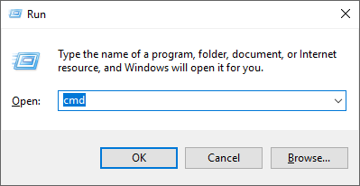
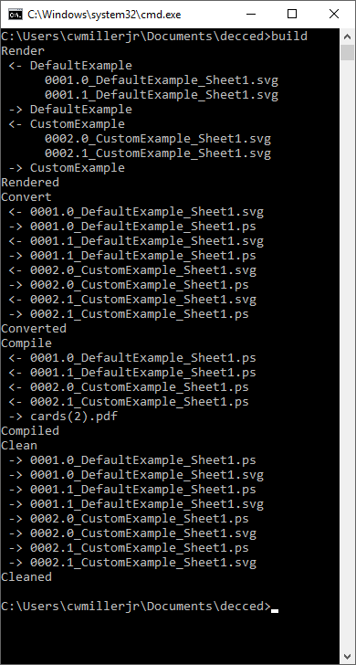
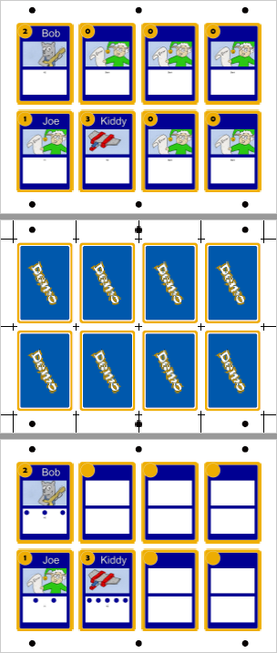
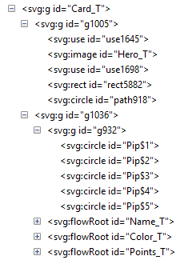

# DeCCed Card Builder
**DeCCed** /dɛkt/ was created as part of the Christmas Chaos project.  I knew I did not want to have to manage updating hundreds of cards in layout editors, etc., as I made revisions and that I had no easy way to merge data files in the programs I had available.  I had used SVG in my professional work and had a pretty good understanding of how to navigate its XML files.  I figured since SVG is just XML, I should be able to just modify the XML directly, which is just what I did.  **DeCCed** is just the De"Christmas Chaos"ed version of this utility.

## Basic Architecture
**DeCCed** is configuration and "card driver" powered. 
* To create a card, first you'll need a card template.  You can copy a template or create your own.  In the template, you'll need just one card defined, and on that card, you'll need to tag the items that you want to update at runtime.
I've developed a method for creating the SVG templates that worked for me, but it is not necessary.
* To tell **DeCCed** what the cards it should create should contain, you'll create a "Manifest" file.  This is simply an Excel file (or tab delimited text if you prefer) with a column for each bit of information you need on the card.  For example, a name or point value.  One row for each card.
* Next you'll need to either create a "card driver".  Essentially this is just two methods you create.
    * One to map values for each row in the "Manifest" file to a POJO "Manifest" entry.
    * One to map the "Manifest" entry values to the various tagged locations in the template.

Or create an options.json file in the card directory and DeCCed will infer the column names from the Excel file by the first row starting with an "$".

**DeCCed** takes care of the rest and will create a necessary number of SVG files to create all the cards you defined.  You can also define more that one card type to be created at once.  With a few other ***free*** programs installed, you can even create a single PDF file with all of your cards, including the backs of the cards, which can be printed double sided for quick prototyping.
These programs are [Inkscape](https://inkscape.org) and [Ghost Script](https://www.ghostscript.com).  As long as you install them in the default locations, **DeCCed** will be able to find them.

## Examples
Looking in the Cards directory you'll find two examples.  The first is the convention based example named ***DefaultExample*** where the first line of the file starts with a "$" and therefore needs no programming at all.  You can see in the options.json some default values have been set up for the remaining cards on the sheet there aren't records for.

The second example ***CustomExample*** shows a more advanced card where there are pips on the card that need to be shown or hidden based on the manifest file.

## Installing
### DeCCed project
You'll first need to download the project from [https://github.com/cwmillerjr/decced](https://github.com/cwmillerjr/decced).  If you are not proficient with git or do not want to use it, you can simply download the project in a zip file like so:


### Node.js
DeCCed is a Node.js application, so you'll need an install of Node.js to use it.  This is pretty simple.  You just run the installer that is provided on the homepage of [Node.js](https://nodejs.org/).  I usually use the LTS version because reasons.

Once you've installed that, you can now create SVG files with DeCCed, but those are difficult to work with and hard to print 1:1 scale, so I also added support to convert all of it into a PDF I could print on both sides, which required two other programs.

### Inkscape
Inkscape is a free program I used to create the card templates.  It also is used to convert the SVG output files into Post Script files as an intermediate step in converting it to PDF.  You can find Inkscape at [Inkscape.com](https://inkscape.org/).  As long as you install it in the standard location, DeCCed will be able to find it.

### Ghost Script
The final program needed was Ghost Script.  This program can do many amazing things, of which I used it to smash the PS files created in the last step into a single PDF file for printing, etc.  You can find it at [ghostscript.com](https://www.ghostscript.com/download/gsdnld.html) and again, as long as you install it in the default location, DeCCed will find it.

## Using DeCCed

### Open command prompt
In Windows, press Windows Key + R to open the Run modal.  Enter `CMD` and press Ok.



### Install NPM Packages
The first time you use the project, you'll need to restore the npm packages.  Type in `install` and hit enter.


### Build
To generate configured cards, type `build` and enter.



### Output
By default, you'll find the cards in the renders directory under the path you unzipped the project to.  You can view the output with Adobe Reader, etc.



## What are those marks?

### Alignment Marks
Since I produced my cards by printing on one side of linen and then laminating those with cardstock between, I needed a way to align the front and backs of the cards.  These are the black dots.  The dots are spaced the standard distance for a three ring binder.  I punched holes at these spots and then used a jig to align them when I glued them.

### Crop Marks
The cross marks are the cut lines.  I have them only on the backs since I try to make sure the backs are always as uniform as possible since that is the side you'd be able to read if they are face down.  If the face is a bit off, that is only noticeable after you've drawn the card.  I used a arm shear to cut the cards.

## CardFace.svg
The base image used for a card is CardFace.svg.  I use Inkscape to create these files and, while this isn't a primer on Inkscape, you will need to know how to edit the XML inside Inkscape.  The following assumes you have loaded Inkscape and opened Cards/CustomExample/CardFace.svg.

### XML Editor
To view the XML Editor, inside Inkscape, press Shift-Ctrl-X. You may have to expand the tree, but you want to find the node that is either id "Card_T" or "Card$" (more about this later).  It should look like below, in a fashion.



### XML Sections
In the XML viewer you'll see various nodes with id's set to specific values.  The main points will be discussed.

#### About \_T and $
All tags you want to be able to map from a card manifest to a card must have \_T or $ in the id.  This will be replaced in the copies with the card position on the page, therefore Card\_T would become Card1, Card2, Card3, ..., Card8.  \_T and $ are interchangeable and considered the same, although $ is the preferred naming and \_T is depredated.

### Card Group
The card you're prototyping must all be contained inside a group.  This group will be copied and placed on the page by DeCCed at run time.  The name of the group should be Card$.  Anything outside of this group will not be part of the card and will not be copied or numbered.

### Replacements
The default replacements in DeCCed will look for id's named with a $ or \_T.  For example, in the above snippet, Name\_T and Color\_T will become Name1...Name8, and Color1...Color8.  These represent the name and color text on the card.  In the default manifest, the columns marked Name and Color will map to these objects.

#### Images
In this example, Hero\_T.  With images in the DefaultExample, you can give the relative path to the image (from the target directory, ../Renders by default), or simply just the name of a png without the extension.  If you give the name without the extension, DeCCed will probe for the png using the current Card directory's Assets folder, the Card directory, and then the root Assets folder.  Therefore you can share images between cards by putting them in the ./Assets directory.  For the CustomExample, you'll need to call `probleImage` to find the image because it does not manipulate the value unless you explicitly ask it to.

### Custom Replacements
In this example, you see the collection of Pip$n (Pip$1, Pip$2, etc.)  These will become Pip11, Pip12...Pip18, Pip21...Pip28, etc.  In the custom example, there is code that manually maps the svg file and actually will make these pips hidden or shown based on values from the manifest.  This allows you great control over how your cards are rendered.

## Card Driver
See [CustomExample/card.js](https://github.com/cwmillerjr/decced/blob/master/Cards/CustomExample/card.js) for and example of a card driver.  The code is commented and will be the most up to date explanation.

## options.json
### Default Example
If you look at the options.json file for the DefaultExample card, you'll see a simple options file.  It only contains the Name and a default manifest record to use if there are more cards left on a page than there are manifest records to fill it.

```
{
    "cardName_" : "DefaultExample",
    "defaultManifest":
    {
        "Name" : "",
        "Points" : "0",
        "Color" : "Blank",
        "Hero" : "error"
    }
}
```
If you want to use the default default and use the Card directory name as the card name, a simple empty (`{}`) json file would do.  You do need an empty one to let DeCCed know that is a card directory you want to use.

### Other options
Universal options can be set in the config.json in the root directory.  (More about the config.json file below.)  To add options to the config.json file, create a node called "options" like such. 
```
{
    "options" : {
        "blankCards" : "0s",
        "blackout" : false,
        "backs" : true,
        "cropMarks" : "back"
    }
}
```

### Available Options
Options are what make DeCCed easy to prototype with becasue I can easily change what I'm rendering and different levels of detail, etc.

|Option|Effect|type|default|
|----|----|----|---|
|backs|Render the backs of the cards.|boolean|true|
|blackout|Render a large black box on the back of the front of the card|boolean|false|
|blankCards|Render a number of cards or number of sheets of cards with the default manifest at the end of the manifest cards|string of format nnn(s), i.e. 0s, 3, etc.  "s" denotes a full sheet of cards, not just 1 per number.|"0s"|
|cardBack|Name of the card to pull the card backing from.  This allows you to reuse another card's back side for multiple cards.|string card path|null|
|cropMarks|Render Crop Marks on the image|string or an array of strings|["back"]|

## config.json
Looking in the root directory, you'll see a file named config.json.  This contains the configuration for the application, mainly universal options as well as build definitions.  It's basic format is below.

```
{
    "build" : "proofs",
    "builds" :{
        "default": {
            "cards": [
                "Resource",
                "Helpers",
                "Chaos",
                "Toy"
            ],
            "renderPath": "../Renders",
            "tasks": {
                "render" : true,
                "convert" : true,
                "compile" : true,
                "clean" : ["ps", "svg"]
            }
        },
        "debug": {
            ...
        }
        ...,
        "proofs": {
            ...,
            "renderPath": "../Proofs",
            ...,
            "options" :{
                "blackout" : false,
                "backs" : false,
                "breakoutPdfs" : true,
                "skipMainPdf" : true,
                "manifestSuffix" : "_proof"
            }
        },
        ...
    },
    "options" : {
        ...
    }
}
```

### build
The build node denotes which of the different builds the app will use.  The default is default.

### builds
The builds hash contains any build definitions you want to define.  Each of these defines which cards to render and how to render them.

#### cards
The node cards is an array of cards to include in this build.  This allows you to exclude certain cards for special cases, like only printing out a subset of cards to replace one set during playtesting.

#### tasks
This node is a hash of the various tasks to perform in the build.
|Name|Effect|Type|Default|
|--|--|--|--|
|render|If true, render the svg files for the cards.|boolean|true|
|convert|If true, convert the svg files into post script files as an intermediate step|boolean|true|
|compile|If true, compile all the post script files into one PDF file for printing.|boolean|true|
|clean|Clean the files created with the extensions specified|string array|[]|